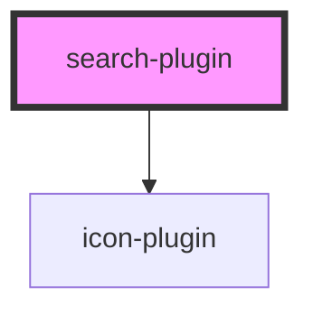

# tooltip-plugin

<!-- Auto Generated Below -->

## Properties

| Property                  | Attribute      | Description                                   | Type     | Default     |
| ------------------------- | -------------- | --------------------------------------------- | -------- | ----------- |
| `dataTestId` _(required)_ | `data-test-id` | Unique id to identify the element for testing | `string` | `undefined` |
| `placeHolder`             | `place-holder` | Placeholder for search input                  | `string` | `"Search"`  |
| `value`                   | `value`        | Search text input value                       | `string` | `""`        |

## Events

| Event           | Description                     | Type               |
| --------------- | ------------------------------- | ------------------ |
| `clearSearch`   | Emitted when clearing the input | `CustomEvent<any>` |
| `searchRequest` | Emitted when onChange and enter | `CustomEvent<any>` |

## Dependencies

### Depends on

- icon-plugin

### Graph

----------------------------------------------

